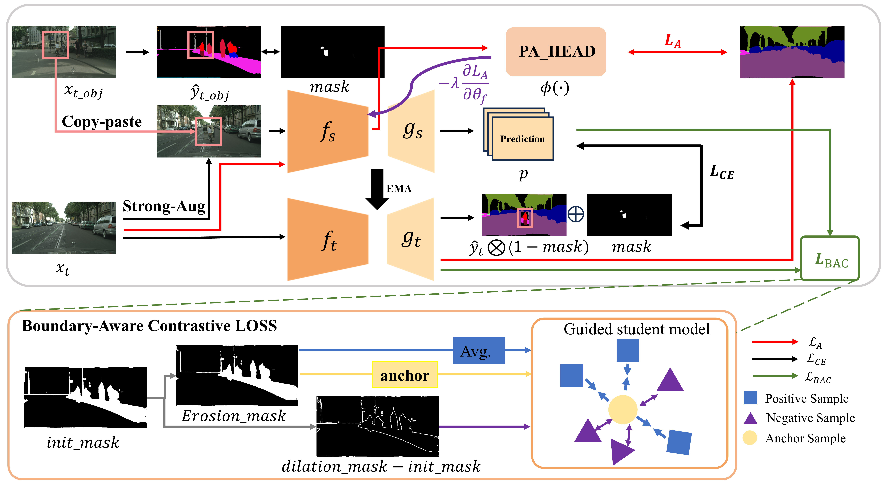

##Towards Robust Source-Free Unsupervised Domain Adaptation in Semantic Segmentation with Pseudo-Adversarial and Boundary-Aware Contrastive Learning##

###Comparison with various uncertainty estimation methods###

###Pipeline###

###Requirements###
Please see requirements.txt for all the other requirements.

###Getting started###
## Data Availability

The datasets used in this study are publicly available benchmark datasets:  

- **Cityscapes:** [https://www.cityscapes-dataset.com/](https://www.cityscapes-dataset.com/)  
- **ACDC:** [https://acdc.vision.ee.ethz.ch/](https://acdc.vision.ee.ethz.ch/)  
- **GTA5:** [https://download.visinf.tu-darmstadt.de/data/from_games/](https://download.visinf.tu-darmstadt.de/data/from_games/)  
- **SYNTHIA:** [https://synthia-dataset.net/](https://synthia-dataset.net/)  

Additional experimental data and code supporting the findings of this study are available from the corresponding author upon reasonable request.

